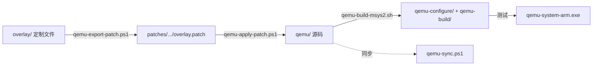

# qemu-embedded-platform

基于 QEMU 的嵌入式平台开发环境，内置针对 ARM `mps2-an505`（Cortex-M33）目标板的定制 overlay 补丁，并提供一键打补丁 + 构建 + 运行的完整工作流（Windows / MSYS2）。

---

## 目录结构

```
qemu-embedded-platform/
├── configs/
│   └── qemu.json            # QEMU 版本配置（branch / commit / overlay）
├── overlay/
│   └── qemu/
│       └── master/          # 对 QEMU 源码的定制文件（hw/、include/）
├── patches/
│   └── qemu/
│       └── master/
│           └── overlay.patch  # 由 overlay 导出的补丁
├── qemu/                    # QEMU 源码（git submodule，受 overlay 补丁定制）
│   ├── qemu-configure/      # 构建配置目录（configure 产物）
│   └── qemu-build/          # 安装目录（--prefix，含 qemu-system-arm.exe）
├── scripts/
│   ├── qemu-build.ps1       # 一键：打补丁 + 构建（推荐入口）
│   ├── qemu-build-msys2.sh  # 实际构建脚本（MSYS2 MINGW64 内运行）
│   ├── qemu-apply-patch.ps1 # 应用 overlay 补丁
│   ├── qemu-sync.ps1        # 同步 qemu 子模块到配置的 commit
│   └── qemu-export-patch.ps1# 把 overlay 导出为补丁
├── testcase/
│   └── an505-qemu.elf       # 测试固件
└── documents/
    └── msys2_qemu_build_steps.md  # 详细的 MSYS2 环境搭建与 QEMU 构建步骤
```

---

## 环境准备

- **Windows** + **MSYS2**（含 MINGW64 环境）
- MSYS2 中需安装 QEMU 构建依赖（`base-devel`、`mingw-w64-x86_64-toolchain`、`glib2`、`pixman`、`gtk3`、`SDL2` 等）
- 详细的环境搭建步骤见 [`documents/msys2_qemu_build_steps.md`](documents/msys2_qemu_build_steps.md)

> 首次构建前请先 `git submodule update --init --recursive` 拉取 `qemu` 子模块。

---

## 快速开始（一键构建）

在仓库根目录执行：

```powershell
.\scripts\qemu-build.ps1
```

脚本会自动完成：
1. **打补丁**：调用 `qemu-apply-patch.ps1` 应用 overlay 补丁
2. **构建**：以管理员权限在 MSYS2 MINGW64 中执行 `qemu-build-msys2.sh`（configure → make → install → 运行测试）

> 注意：弹出 UAC 授权窗口时点击"是"。QEMU 的 configure 在 Windows 上需要创建符号链接（`scripts/symlink-install-tree.py`），未开启开发者模式时必须使用管理员权限。

### 常用参数

| 参数 | 说明 |
|------|------|
| `-SkipPatch` | 跳过打补丁，只构建（适合快速增量重建） |
| `-SkipAdmin` | 不申请管理员权限（仅当已开启 Windows 开发者模式时可用） |
| `-Msys2Root C:\msys64` | 手动指定 MSYS2 安装目录 |
| `-ConfigFile configs\qemu.json` | 指定配置文件（默认 `configs/qemu.json`） |

**MSYS2 目录的自动探测顺序**（不传 `-Msys2Root` 时）：
1. `$env:USERPROFILE\program\MSYS64`
2. `C:\msys64` or `C:\msys2`
3. 注册表（MSYS2 卸载信息）

若显式传入 `-Msys2Root`，则直接使用该路径，路径无效会立即报错。

---

## 完整工作流

### 1. 同步 QEMU 子模块到指定版本

```powershell
.\scripts\qemu-sync.ps1
```

按 `configs/qemu.json` 中的 `branch` / `commit` 同步 `qemu` 子模块。

### 2. 应用 overlay 补丁

```powershell
.\scripts\qemu-apply-patch.ps1
```

将 `patches/qemu/master/overlay.patch` 应用到 `qemu/` 源码。会先重置工作区再打补丁；**保留构建目录 `qemu-configure/`、`qemu-build/`**，便于增量构建。

### 3. 构建

```powershell
.\scripts\qemu-build-msys2.sh
```

> 需在 **MSYS2 MINGW64** 环境中执行（管理员权限，如未开启开发者模式）。也可以通过 `qemu-build.ps1` 自动完成。

脚本会：
- configure（若 `qemu-configure/config-host.mak` 已存在则跳过，实现增量构建）
- `make` 增量编译（`--target-list=arm-softmmu`，开启 debug，关闭 docs）
- `make install` 安装到 `qemu/qemu-build/`
- 自动运行测试

### 4. 运行测试

构建脚本会自动执行：

```powershell
.\qemu\qemu-build\qemu-system-arm.exe -machine mps2-an505 -cpu cortex-m33 -m 16M -kernel .\testcase\an505-qemu.elf -display sdl,show-cursor=on -serial stdio
```

也可以手动复制 `qemu/qemu-build/qemu-system-arm.exe` 到 `testcase/` 后运行：

```powershell
cd .\testcase
.\qemu-system-arm.exe -machine mps2-an505 -cpu cortex-m33 -m 16M -kernel .\an505-qemu.elf -display sdl,show-cursor=on -serial stdio
```

### 5. 修改定制并导出补丁（可选）

修改 `overlay/qemu/master/` 下的文件后，重新导出补丁：

```powershell
.\scripts\qemu-export-patch.ps1
```

---

## 工作流程示意



---

## 配置说明（configs/qemu.json）

```json
{
    "branch": "master",
    "commit": "3e3ccab106f879b1512f8e0d51a827dd4de30e22",
    "overlay": "master"
}
```

| 字段 | 说明 |
|------|------|
| `branch` | QEMU 源码分支 |
| `commit` | 同步/回退到的 QEMU commit |
| `overlay` | 使用的 overlay 名称（对应 `overlay/qemu/<name>/` 与 `patches/qemu/<name>/`） |

---

## 常见问题

- **为什么需要管理员权限？** QEMU configure 在 Windows 上创建符号链接（`scripts/symlink-install-tree.py`）。除非开启 Windows 开发者模式，否则必须管理员运行。可用 `-SkipAdmin` 跳过（仅开发者模式开启时）。
- **每次构建都出现 `Regenerating build files`？** 正常。打补丁会重写 meson.build 等文件，Meson 自动重新生成构建文件（检测结果带 `cached`，很快），不是全量 configure。
- **如何避免全量重新 configure？** `qemu-configure/` 会被打补丁脚本保留；只要它存在，构建就会跳过 configure 直接增量 make。想强制全新配置时手动删除 `qemu/qemu-configure` 与 `qemu/qemu-build`。
- **快速重建**：只改了 QEMU 源码、未改 overlay/补丁时，用 `.\scripts\qemu-build.ps1 -SkipPatch` 最快。

---

## 相关文档

- [MSYS2 环境搭建与 QEMU 构建详细步骤](documents/msys2_qemu_build_steps.md)


